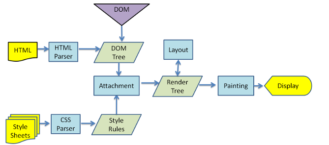

# 02. 页面加载

##01. 浏览器如何工作

上图是webkit内核渲染html和css的流程图。大家可以从图中看到，html的解析是一条线，css的解析是一条线，两者会在某一点结合，形成最终的视图。

如果我们以CSS为重点看，从上图中我们可以总结出学习CSS的三个突破点:
1. 浏览器如何加载和解析CSS——CSS的5个来源；
2. CSS和html如何结合起来——选择器；
3. CSS能控制那些显示方式——盒子模式、浮动、定位、背景、字体等；

##02.CSS的加载过程
CSS——Cascading Style Sheets——层叠样式表。“样式表”大家比较好理解，那何为“层叠”呢？从字面意思来看，层叠肯定是需要多层叠加起来。而这个“多层CSS”到底有几层，每一层是什么，我们程序猿用到的将是哪些层？这几个问题将是我们讨论的重点。

另外，这么多层次叠加，如果出现冲突怎么处理，以哪个为准？这也是我们讨论的重点。

最后，在这些层次中有一个“浏览器默认样式”层，即浏览器默认的各个html元素的样式。这次我们像浏览器这位“机器人”学习一下，看看它写出来的css能给我们什么帮助。

##03. CSS和HTML的结合
　　CSS如何与html结合呢——当然是通过选择器。CSS提供了多种多样的选择器类型，而且每个级别都在不断的增加新的选择器类型，使得选择器更加灵活易用。本系列将拿出一篇文章专门讲解选择器。

　　聪明的人类也通过css提供的选择器在其他临近的方面开疆拓土，例如jquery，zen-coding。

　　对css选择器来说，有一个很重要的话题——级别。在大部分web前端面试题中，你都会看到css选择器级别的判断问题。《css设计指南》书中给出了一个概念——特指度，而且给出了计算公式和计算规则，还给出了一个简单的背诵口诀。想的真周到。

最后，与选择器关联密切的还有伪类和伪元素，我们也将拿出一篇文章专门讲解伪类和伪元素，以及它们最典型的用法。

##04. 页面呈现
　　页面呈现可以分为两类——文字，块。

针对文字来说，我们可以设置字体、字号、加粗、斜体、背景色等等；

对于块来说情况比较多，有盒子模型、浮动、定位、display、背景等；

本系列会拿出很大的篇幅去讲解其中的基础知识，以及他们的一些重点应用。

##05. 布局
　　布局是css的重头戏，每个系统的布局都有其各自的特点。无好无坏，肯定是各有优缺点，不妨拿出几个比较典型的例子来一起分析一下。例如：

经典三列布局
Bootstrap栅格布局
百度首页布局
微博布局
人人网布局
瀑布流布局
 ……