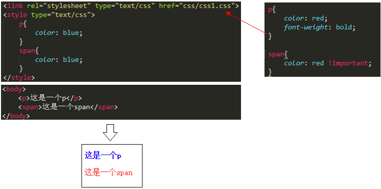
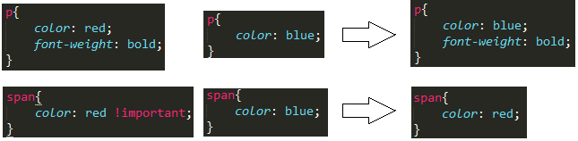
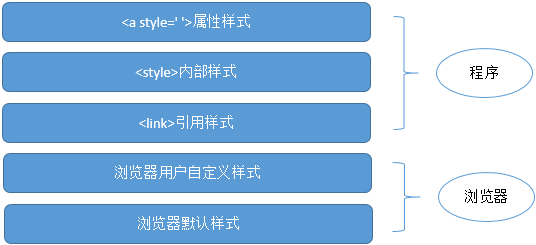
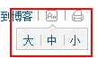
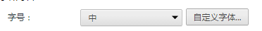
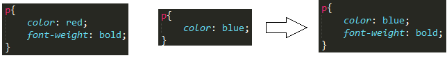
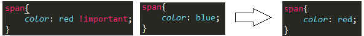

# 03 样式来源与层叠规则

##01. “层叠”的概念
　　CSS——层叠样式表，其中的“层叠”是什么意思呢？层叠就是浏览器对多个样式来源进行叠加，最终确定结果的过程。举一个简单的例子：

上图中有两个样式来源，第一个是引用的css1.css，第二个是自己在style中编写的样式。“层叠”是个叠加的过程，可通过下图表示：

上面用一个简单的例子来说明了层叠的过程，形象的体验一下。

>层叠是CSS的核心机制，理解了它才能以最经济的方式写出最容易改动的CSS，让文档外观在达到设计要求的同时，也给用户留下一些空间，让他们根据需要更改文档的显示效果，例如调整字号。——摘自《CSS设计指南》

##02. 样式来源
上文中提到，css之所以有“层叠”的概念，是因为有多个样式来源。其实css的样式来源有5个，开发人员只能接触到后面3个。

 第一，浏览器默认样式表

当你不为html设置任何样式时，显示在浏览器上，b标签会显示粗体、p有纵向margin、h1字号比p大一倍……这是为什么呢？

因为浏览器自带一个默认的样式，如果html中没有为标签设置样式，则浏览器会按照自己的样式来显示。但是浏览器默认样式的级别是最低的，一旦有其他地方设置了标签样式，浏览器默认样式就会被冲掉。

注意，不同浏览器的默认样式有些地方是不一样的。例如，我们在写css时，都会首先设置 * {margin:0; padding:0;}，这是为何？就是因为有浏览器兼容性问题。干脆，全部弄成0，这样各个浏览器就都统一了。

此处先把默认样式的代码贴出来，我们下一节专门解说默认样式，有很多值得玩味的地方。
```
html, address,blockquote,body, dd, div,dl, dt, fieldset, form,frame, frameset,h1, h2, h3, h4,h5, h6, noframes,ol, p, ul, center,dir, hr, menu, pre { display: block }/*以上列表元素默认状态下一块状显示，未显示的将以内联元素显示，该列表针对HTML4版本，部分元素在XHTML1中将废弃*/
li { display: list-item }/*默认以列表显示*/
head { display: none }/*默认不显示*/
table { display: table }/*默认为表格显示*/
tr { display: table-row }/*默认为表格行显示*/
thead { display: table-header-group }/*默认为表格头部分组显示*/
tbody { display: table-row-group }/*默认为表格行分组显示*/
tfoot { display: table-footer-group }/*默认为表格底部分组显示*/
col { display: table-column }/*默认为表格列显示*/
colgroup { display: table-column-group }/*默认为表格列分组显示*/
td, th { display: table-cell; }/*默认为单元格显示*/
caption { display: table-caption }/*默认为表格标题显示*/
th { font-weight: bolder; text-align: center }/*默认为表格标题显示，呈现加粗居中状态*/
caption { text-align: center }/*默认为表格标题显示，呈现居中状态*/
body { margin: 8px; line-height: 1.12 }
h1 { font-size: 2em; margin: .67em 0 }
h2 { font-size: 1.5em; margin: .75em 0 }
h3 { font-size: 1.17em; margin: .83em 0 }
h4, p, blockquote, ul, fieldset, form, ol, dl, dir, menu { margin: 1.12em 0 }
h5 { font-size: .83em; margin: 1.5em 0 }
h6 { font-size: .75em; margin: 1.67em 0 }
h1, h2, h3, h4, h5, h6, b,strong { font-weight: bolder }
blockquote { margin-left: 40px; margin-right: 40px }
i, cite, em,var, address { font-style: italic }
pre, tt, code, kbd, samp { font-family: monospace }
pre { white-space: pre }
button, textarea, input, object, select { display:inline-block; }
big { font-size: 1.17em }
small, sub, sup { font-size: .83em }
sub { vertical-align: sub }/*定义sub元素默认为下标显示*/
sup { vertical-align: super }/*定义sub元素默认为上标显示*/
table { border-spacing: 2px; }
thead, tbody, tfoot { vertical-align: middle }/*定义表头、主体表、表脚元素默认为垂直对齐*/
td, th { vertical-align: inherit }/*定义单元格、列标题默认为垂直对齐默认为继承*/
s, strike, del { text-decoration: line-through }/*定义这些元素默认为删除线显示*/
hr { border: 1px inset }/*定义分割线默认为1px宽的3D凹边效果*/
ol, ul, dir, menu, dd { margin-left: 40px }
ol { list-style-type: decimal }
ol ul, ul ol, ul ul, ol ol { margin-top: 0; margin-bottom: 0 }
u, ins { text-decoration: underline }
br:before { content: "A" }/*定义换行元素的伪对象内容样式*/
:before, :after { white-space: pre-line }/*定义伪对象空格字符的默认样式*/
center { text-align: center }
abbr, acronym { font-variant: small-caps; letter-spacing: 0.1em }
:link, :visited { text-decoration: underline }
:focus { outline: thin dotted invert }
 /* Begin bidirectionality settings (do not change) */
BDO[DIR="ltr"] { direction: ltr; unicode-bidi: bidi-override }/*定义BDO元素当其属性为DIR="ltr"时的默认文本读写显示顺序*/
BDO[DIR="rtl"] { direction: rtl; unicode-bidi: bidi-override }/*定义BDO元素当其属性为DIR="rtl"时的默认文本读写显示顺序*/
*[DIR="ltr"] { direction: ltr; unicode-bidi: embed }/*定义任何元素当其属性为DIR="ltr"时的默认文本读写显示顺序*/
*[DIR="rtl"] { direction: rtl; unicode-bidi: embed }/*定义任何元素当其属性为DIR="rtl"时的默认文本读写显示顺序*/
@media print { /*定义标题和列表默认的打印样式*/
    h1 { page-break-before: always }
    h1, h2, h3,    h4, h5, h6 { page-break-after: avoid }
    ul, ol, dl { page-break-before: avoid }
}

浏览器默认样式
```
 第二，用户样式表

在一些新闻网站中，经常看到可以设置字体大小的快捷菜单，例如下图就是搜狐新闻中的设置。


这些是给一些有视觉障碍的人看的，反正我是没用过，我也有视觉障碍，不过我是通过近视镜来解决的。

其实浏览器也有这样的设置，例如chrome浏览器中，我们就可以设置字号和字体。
用户在这里设置了字体和字号之后，它们会覆盖掉浏览器默认的样式。


第三，<link>引用的css文件
引用css文件，大家应该都比较熟悉了。

第四，<style>中编写的样式代码
<style>中编写样式也都比较熟悉。

第五，<a style=’ ’>中编写的样式代码
标签style属性中编写样式，也都用过吧。

##03．层叠的规则
由于样式的来源不同，浏览器在加载样式时，需要计算出最终的样式值，这样才能显示出正确的界面效果——浏览器会通过叠加和覆盖这两种方式来生成最终的样式值。

下面是举例说明：

如上图，不同来源的两个样式，第一个样式设置了font-weight，第二个没有，浏览器会把它叠加在一起，即浏览器会把各个零散的整合成一个整体。第一个样式color:red，第二个样式color:blue，浏览器会让后者覆盖前者，最终结果还是color:blue。

覆盖的默认规则是后者覆盖前者，但是又一个特殊情况——!important。

如上图。虽然color:blue是后来者，但是它没有居上，因为前者color:red跟着!important。这就像得到一个尚方宝剑，有最高执行权，其他人统统让路，否则佛挡杀佛。

##04.总结
本文主要讲解了css的5个来源，以及浏览器叠加样式的过程和方法，这是学习css最基础的知识。