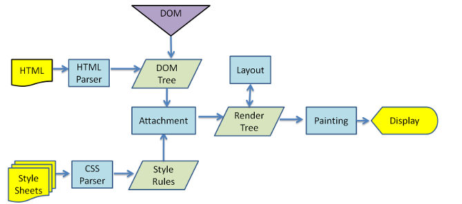

# 04 浏览器默认样式

## 01.理念转变
在解读代码之前，我先把我看浏览器默认样式最大的体会给大家说一下，这个是非常重要的。就是要先从理念上重新认识html和css。

以前我都是认为浏览器自身本来就认识各种html标签，并且会根据规则设置标签的样子，例如p是block显示，ul有margin-left，h1粗体显示……以前以为这些标签默认的显示方式和css无关，是浏览器自己干的，css设置网页样式是加载之后又渲染的。

现在知道这种想法是错误的。其实浏览器加载了html之后只为一件东西——dom树，浏览器把html变为dom树结构，就完成了对html的结构化。至于后来对视图的渲染，p是block、br换行，那是整合了css之后的事情。而浏览器整合css又是另一个路线，和解析html是分开的。这里的“css”就包含了浏览器默认样式。

>一句话，浏览器将载入的html变为dom树，但是此时没有任何显示样式。所以显示的样式，都是css定义的，浏览器只会通过css来渲染视图样式。
——多好的设计：指责单一，开放封闭！

##02. block元素

为何默认情况下p、h1、ul、div都是block显示，就是这里定义的。所以，不要再说div天生就是block——这句话应该换成：**浏览器默认样式天生规定了div是block——所以才导致了div是block！是默认样式规定的，不是浏览器的内核规定的**。

没有设置block的元素，默认为inline显示。

##03. display: list-item

我们在使用display时，常用的值一般是：inline/block/inline-block，用不到list-item。那这里的list-item到底有什么作用？我们不妨亲自试一试：

看到没有，出现了ul-li中的效果了吧，如果再加一个margin-left是不是就跟ul-li一样了？

所以，ul-li为什么会默认显示成那种样子？——list-item才是“罪魁祸首”。

##04. diplay:table

先给出一个快速思考题：`<table>`和`
`在容器尺寸上最大区别是什么（只是容器尺寸，不考虑内容区别）？请在两秒钟内说出答案。

答案是——div宽度和父容器相同，table宽度根据内容而定——即table具有“包裹性”。
举一个例子：

上图中，第一个div默认是block，宽度撑满整个页面。第二个div设置了display:table，宽度根据内容而定。这就是“包裹性”。而提到“包裹性”，又不得不让我想到float和absolute。具体怎样这里无法细说，后面的文章会详细讲到，有兴趣的可以先查着。

各位思考一下，你们做的项目中，哪些地方想要这种“包裹性”，而不是写死宽度或者用js计算宽度？如果想不到，我给大家截个图提醒一下。如下图：

##05. display: table-cell

上面的截图中，我们看到了眼花缭乱的好多display，而且都是和table相关的。从字面意思上我们能看出，这是浏览器为了渲染一个完整的表格，而需要的许多显示方式（PS：看似一个简单的表格，渲染规则就这么多，这就提醒我们思考问题的严谨性和逻辑性）。

这里的大部分都是我们一直都不会用到的，用不到的了解即可，没必要深究。但是这个table-cell我们却能用得到，而且是用它来干一件很重要的事情——多列布局。

多列布局在css中有多重要就不用我说了吧，传统模式下大家都使用float来解决这一问题，但是float写出来的东西代码复杂，宽度调整不灵活，浏览器兼容性有问题。所以才有了新方案——`table-cell`，注意，IE6、7不行！
简单举个例子：

记得我刚学html时候，不会用div+css做多列布局，我就用table做多列布局。而今，你可以用table-cell，像用table一样做多列布局，做出来的效果和table做出来的效果是一模一样的。

##06. body样式

在body中，定义了两个样式，如上图。

第一，在默认情况下，页面中的文字不会直接顶到浏览器的边框，这就是因为默认样式为body设置了margin的缘故。这里需要注意个问题，不同浏览器为body设置的margin值可能不一样，因此大家都知道在css中用 `*{margin:0}` 来解决这一兼容性问题。

之前已经提到过，`*选择器`的级别要低于body标签选择器，但是`*{margin:0}`依然有效的原因，就是浏览器偷偷的做了优先级的手脚。如果在正常情况下，`*选择器`在遇到标签选择器时，是不会起作用的，及时它是“后加载”的。例如：

第二，浏览器默认样式还为body设置了line-height，line-height这个值1.12是对英文比较友好，中文状态下就显得有点拥挤。Line-height是具有继承性的，在body中设置了，body下面所有的文字都会继承生效。

另外注意，这里的`line-height: 1.12`是一个相对值，即是文字高度的1.12倍。看到这里，我们在写line-height的时候，也一定要注意使用相对值，不要使用绝对值。如下：

上图是编写line-height的三种形式，大家觉得哪种形式最好？区别是什么？

+ 情况1：永远按照文字的1.4倍计算，不管文字的高度如何，可适应任何变化；
+ 情况2：永远按照1.4em计算，随着em的值改变，不管文字高度如何（此时文字高度可能已经通过绝对的px值该表了大小，而不是随em改变的）；
+ 情况3：就是25px，绝对的。

相信看到这里大家会发现，通过一个line-height我能能窥探到的道道有很多。如果大家看懂了这三种情况，从软件设计和系统扩展的角度说，当然我们都会选择第一种。

##07. em和px

大家在设置文字高度或者与文字有关的距离，如p的margin、line-heigt（上文刚讲完，不再赘述），会用em还是用px？——反正我之前不熟悉css时候，都是用px。因为px是固定大小，一目了然。——当然，它也不利于扩展。

因此，我们**推荐大家用em**。而且浏览器的默认样式也建议我们这样书写：

如上图，它设置了h1字体大小2em、纵向margin是0.67em，h2字体大小1.5em、纵向大小0.75em……p的纵向margin是1.12em，字体大小1em（上图中没有，但在整个文件中有）

em是什么？——em是一个浏览器识别的长度单位，但是它不是绝对的、固定的，而是相对的。大家都知道px是一个绝对的长度单位制，它永远不会改变。浏览器默认情况下令1em === 16px。现在你知道为何p默认是16px了吧。而且你还知道了h1是p高度的两倍，h2是p高度的1.5倍……（你知道的越来越多了。。。）

当然，我们可以通过css修改1em的值。

由于font-size和margin都是通过em来定义的，当em被修改时，不管字体大小修改，margin值也会跟着修改。这就是em好用之处！

从现在开始，与字体大小有关的css，全部都用em！

##08. 粗体和斜体

上图中，标注了在整个html中，哪些元素设置了粗体/斜体。重点还是一个思维转换的问题：h1不是天生的粗体，而是设置了font-weight:bolder的样式而已……

这里需要提一句题外话：`<b>`和`<strong>`有啥区别？`<i>`和`<em>`有啥区别？——不知道的话自己去查查吧，看到许多面试题考这个。

##09. inline-block

我相信最初学习使用inline-block的朋友都有一个困惑：inline-block到底是个啥？这时候如果你非常勤奋好学的话，你就去网上查资料，然后做各种实验。——精神可嘉，行为不可取。

学习还是有捷径的。看看浏览器默认样式告诉你的捷径：button、input就是inline-block！这样以点播你就会一下子明白，最起码能给你一个很好的形象的概念。看看button和input的表现，你就知道inline-block是什么样子了：

**能被父容器居中、能设置高度宽度和margin、不会像table或div那样占一正行……——这就是inline-block**——记得这是浏览器默认样式告诉你的。

##10. ` `样式的疑问？？

这里我提出自己的一个疑问。如上图，浏览器默认样式中，对br是这样设置的。

这里的br:before{content:”A”}，” A”并没有显示出来啊？
 的换行到底是谁导致的，是css还是浏览器？

##11. 总结
大家看着是不是很过瘾？反正我写着是挺过瘾的，虽然打字、写代码、画图很累，不过很有成就感——再有你们的鼓励就更好啦！

　　

　　首先，我觉得浏览器默认样式非常重要，所有详细解读其中的重点，希望能给大家带来一些启发。没有解读到的就是一些比较容易理解的，或者不常用的（例如打印的样式设置），可以直接去看看源码。