# 05 选择器
从本节开始，就进入本系列的第二个部分——css和html的结合——说白了就是选择器。

CSS中定义了样式，如何将这些样式设置到相应的html节点上？就不得不通过选择器。让浏览器知道css选择了哪一个dom节点，浏览器就会乖乖的把相应的样式渲染成视图。

至于css能把页面渲染成什么样子，这是本系列的第三部分。

第一部分讲css样式的加载和层叠，第二部分讲选择器以及选择器的等级，第三部分讲呈现的各种样式（背景、字体、定位、浮动等）。这样一个思路，也正式浏览器使用css的流程，是最有效的学习思路。

##01. 选择器分类
说道css选择器，大家都知道有许多种，但是真要你去掰着手指头数一数的话，你可能需要数几分钟。其实这么多选择器，完全可以分为两类：

1.标签选择器（*是特殊情况），可但标签，也可上下文多标签；
2.属性选择器（id和class都是属性，特殊的属性）；

##02. 标签选择器
+ 通用选择器*

通用选择器 * 大家应该都比较熟悉了，最常用的就是 *{margin:0; box-sizing:border-box;}。mragin:0咱们在上一节已经说过，box-sizing:border-box将在后面的盒子模型那块再详细描述。

例如，我们在检测bootstrap3的样式时，也可以看到它用到了 * 选择器：

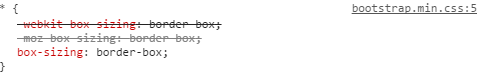

+ 单标签
单标签选择器是最基础的css知识了，在上一节的浏览器默认样式中，到处都用了单标签选择。这里不再赘述，css基础薄弱的朋友，可以先去补补课。

+ 多标签

多标签选择器一般和html上下文有关，它有以下集中分类

1.选择一个祖先的所有子孙节点，例如 div p{…}
2.选择一个父元素的所有直属节点，例如 div > p{…}
3.选择某一个元素紧挨着的兄弟节点，例如 li + li{…}
4.选择某一个元素的所有同胞节点，例如 span ~ a{…}
5.以上各种情况的组合应用（不要组合过于复杂，编码讲求可读性第一）

给大家列举一个比较典型的应用，如下图

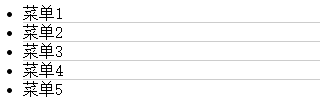
　　
上图中的效果应该比较常见，在各个菜单之间加下划线。我之前的实现是：每个li都加一个border-bottom，在把最后一个li的border-bottom去掉。

其实完全没必要这样麻烦，下面一个样式设置即可解决：

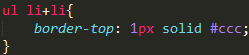
　　
##03. 属性选择器
+ 特殊1：id选择器

按照许多css教程上讲的，id选择器和属性选择器是不同的两个类别，为什么要把id选择器放在属性选择器下面的呢？因为css选择器是根据html节点的特性来设置的，id也是一个属性，只是它是一个比较特殊的属性，每个html节点的id不能重复。

由于特殊，而且比较常用，所以就单独给id选择器一个“#”，本质上就是一个属性选择器。下面两行代码的执行效果完全相同：

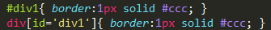

+ 特殊2：class选择器

class也是一个特殊的属性，之所以把它放在属性选择器下，和上文将的id一样。

+ 属性选择器

属性选择器有两种情况：
1.只通过属性名选择：img[title]{…      }
2.通过属性名和属性值选择：input[type=’text’]{…}

这两个也是比较基础的，再次也就不再详细展开了，不了解的朋友可以去看看基础教程补补课。

**伪类和伪元素**
上文提到了若干种选择器类型，伪类和伪元素可针对任何一种选择器使用。

##04. 伪类
伪类分为UI伪类和结构化伪类。

+ UI伪类
UI伪类都比较简单常用，我下面简单写几句代码，就不再详细说了。

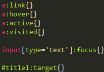

+ 结构化伪类（IE低版本不行）

先问大家一个问题：如何实现一个表格间隔显示背景颜色，如图：

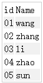

最简单的方式莫过于使用结构化伪类，一句样式设置即可实现。

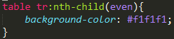

结构化伪类有如下书写选项，至于什么意思，从字面意思即可理解：

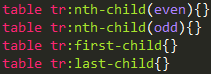

##05. 伪元素

记住，伪元素是一个非常重要的概念！其中，:before和:after 非常常用。
首先，咱们先看看:before和:after是怎么回事儿。

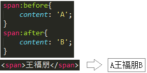

上图中，我们可以看到，可以为元素前后添加内容。这里的“内容”还可以写成unicode编码的方式，如下图：

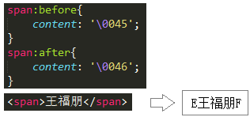

另外，除了可以添加内容外，你还可以自定义执行内容的样式，如下图：

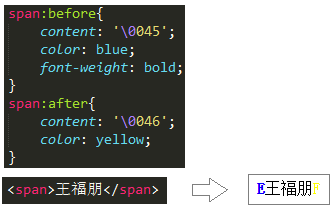

以上大体了解了两者的基本用法，下面给家介绍两个典型的应用场景：
+ 第一，大家都知道fontAwesome吧，web最流行的icon字体库。这些小图标的应用就是通过伪元素来实现的，如下图：

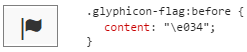

不知道fontAwesome也没关系，我们在讲到css字体时，会详细介绍）
+ 第二，清除浮动的样式大家都知道吧？这就是一个很典型的伪元素应用场景：

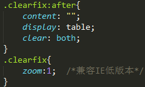

（在讲到css浮动时，会专门讲解clearfix）

##06. 选择器的拓展
选择器本来是css的一种规则，用于为css选择html节点的。但是聪明的人类还是通过选择器创造出了其他领域非常伟大的作品。

+ jQuery

jQuery被推广流行的根本原因就是它的“Query”——基于css选择器的“Query”。现在的浏览器都支持querySelectAll()方法了，其实这就是W3C“抄袭”的jQuery的设计。
相信各位web前端人员对jquery都比较熟悉了，这里点一下即可。

+ zen-Coding

jquery可以通过一段css选择器表达式从既有的html结构中选择符合表达式的dom组，但是zen-coding反其道而行之——可以根据css选择器表达式创造出html节点。不得不佩服这帮人的创造力。

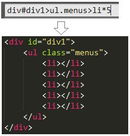

##07. 总结
　　本节总结了css的选择器知识，知道了选择器有若干种类型。但是类型多了不一定是个好事儿，下一节就给大家说说类型太多带来的一个问题，以及解决方案。