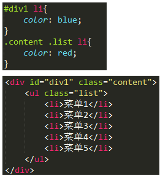

# 06 选择器的优先级

上图中，css中的两个选择器都是针对``的，而且两个设置的颜色不一样，这里的``到底听从谁的命令？
上面还是比较简单的，下面在来一个复杂的：

上图中的`<li>`该显示成什么颜色呢？

##01. 特指度
要解决以上问题，我们需要引入一个概念——特指度（specificity）。特指度表示一个css选择器表达式的重要程度，可以通过一个公式来计算出一个数值，数越大，越重要。

这个计算叫做“I-C-E”计算公式，
1.I——Id；
2.C——Class；
3.E——Element；
　　
即，针对一个css选择器表达式，遇到一个id就往特指度数值中加100，遇到一个class就往特指度数值中加10，遇到一个element就往特指度数值中加1。
下面举几个css表达式的特指度计算结果，大家也自己算一算，是不是对：

|CSS选择器表达式| 特指度计算结果|
|:---|:----|
| p  |  1 |
|      p.large         |   11        |
|      P#large        |   101        |
|      div p#large        |   102        |
|      div p#large ul.list        |   113        |
|      div p#large ul.list li        |   114       |

还有一个重点要注意：**`!important`优先级最高，高于上面一切。`* 选择器`最低，低于一切**。

好了，你现在可以返回文章一开始提出的两个问题，根据特指度计算公式计算，哪个的计算结果大，浏览器就会以哪个为优先。

##02. 简版规则
如果你嫌上面的计算过于复杂，有一个简版规则。它只有三个规则，这三个规则能覆盖大多数情况，而且比较好记。

规则一，包含ID的选择器胜过包含Class的选择器，包含Class的选择器胜过包含元素的选择器；例如下图，第一个特指度更高：

规则二，不同选择器的特指度比较时，不区分加载的顺序（相同选择器在层叠时，后加载的覆盖前加载的），例如下图，虽然后加载，但是特指度低：

规则三，设置的样式高于继承的样式，不用考虑特指度。例如：

其实，大部分情况下，你通过这个简版的规则，即可判断选择器的优先级。

##03. 总结
　　本节的内容是一个重点，我在许多的面试题中看到过考css优先级的问题。css优先级并不麻烦，只要你掌握了合适的方法来学习，一晚上就入门个差不多，祝君好运。

