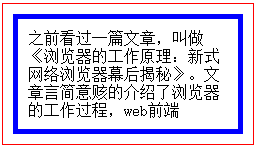
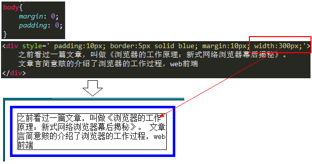
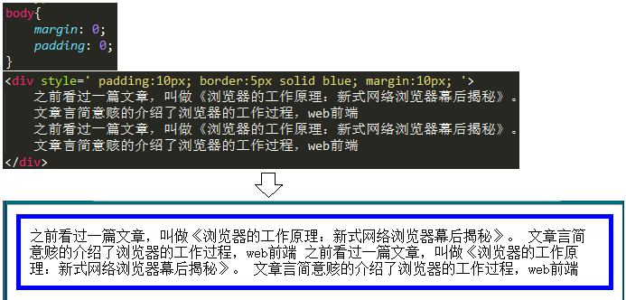
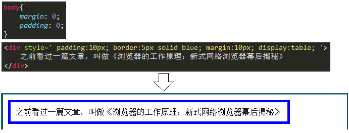
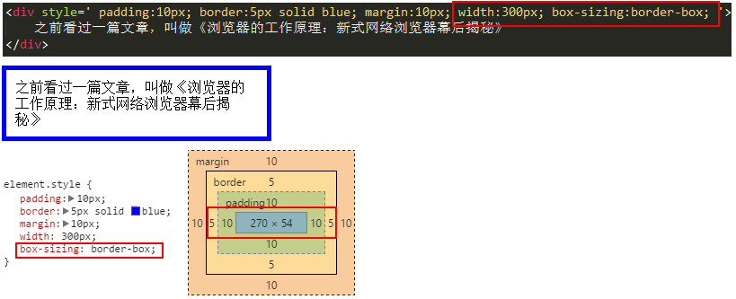
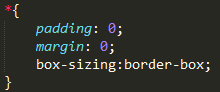
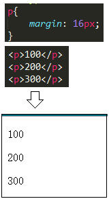
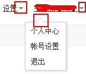
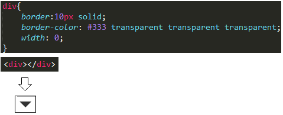

# 07 盒子模型

从这一节开始，我们就进入本系列的第三部分——css呈现。本部分将描述css在页面的几种布局和呈现的特性。包括两类：文字、块。

第一类——文字。这部分相对比较简单一些，例如设置字号、字体、颜色、背景色、是否加粗等。重点的地方在于设置字体、设置行高、文字相关的距离都用相对值，这些东西在《css知多少（4）——解读浏览器默认样式》那一节已经说过了。另外还有一个重点，就是web端最流行的字体库fontAwesome，关于它我之前有一篇文章专门讲过，请参见《请用fontAwesome代替网页icon小图标》，这里就不再重复去讲了。

第二类——块。这部分的知识点非常多，重要的有：盒子模型，float，position，display。本文章讲盒子模型，后面的文章会依次介绍其他的内容。

## 01 什么是"盒子"
真正全面的覆盖了web前端知识体系的东西是——浏览器内核——这并不是说让你去详细了解浏览器内核、做出一个浏览器。浏览器是web前端代码运行的一个平台，浏览器内核里有哪些模块，我们就需要去学习哪些东西。详细的先不说，以后有机会再分享。

这里照顾一下初学者。初学css的朋友，一开始学css基础知识的时候一定学过padding，border和margin，即内边距、边框、外边距。他们三者就构成了一个“盒子”。就像我们收到的快递，本来买了一个小小的iphone，收到的确实那么大一个盒子。因为iphone白色的包装盒和iphone机器之间有间隔层（内边距），iphone白色盒子有厚度，虽然很薄（边框），盒子和快递箱子之间还有一层泡沫板（外边距）。这就是一个典型的盒子。

如上图，真正的内容就是这些文字，文字外围有10px的内边距，5px的border，10px的外边距。看到盒子了吧？

## 02 盒子的宽度
+ 设置了固定宽度的情况下
遇到这种问题，我建议在查询各种资料之前，不如先自己动手做一个实验：

　　

如上图，得到网页效果之后，我们可以用截图工具来量一下文字内容的宽度。发现，文字内容的宽度刚好是300px，就是我们设置的宽度。

因此，**在盒子模型中，我们设置的宽度都是内容宽度，不是整个盒子的宽度**。而整个盒子的宽度是：（内容宽度 + border宽度 + padding宽度 + margin宽度）之和。这样我们改四个中的其中一个，都会导致盒子宽度的改变。这对我们来说不友好。

没关系，这个东西不友好早就有人发现了，而且已经解决，下文再说。

+ 充满父容器的情况下
默认情况下，div的display:block，宽度会充满整个父容器。如下图：

　　　

但是别忘记，这个div是个盒子模型，它的整个宽度包括（内容宽度 + border宽度 + padding宽度 + margin宽度），整个的宽度充满父容器。

问题就在这里。如果父容器宽度不变，我们手动增大margin、border或padding其中一项的宽度值，都会导致内容宽度的减少。极端情况下，如果内容的宽度压缩到不能再压缩了（例如一个字的宽度），那么浏览器会强迫增加父容器的宽度。这可不是我们想要看到的。

+ 包裹内容的情况下
这种情况下比较简单，内容的宽度按照内容计算，盒子的宽度将在内容宽度的基础上再增加（padding宽度 + border宽度 + margin宽度）之和。

　

## 03 再看盒子的宽度
　　前面提到，为盒子模型设置宽度，结果只是设置了内容的宽度，这个不合理。如何解决这一问题？答案就是：`box-sizing:border-box`

　

如上图，div设置了`box-sizing:border-box`之后，300px的宽度是内容 + border + 边框的宽度（不包括margin），这样就比较符合我们的实际要求了。

建议大家在为系统写css时候，第一个样式是：

　

大名鼎鼎的bootstrap也把box-sizing:border-box加入到它的 * 选择器中，我们为什么不这样做呢？

## 04 纵向margin的重叠

这里提到margin，不得不提一下margin的这一特性——纵向重叠。如下图，
的纵向margin是16px，那么两个
之间纵向的距离是多少？

按常理来说应该是 16 + 16 = 32px，但是答案仍然是 16px。因为纵向的margin是会重叠的，大的会把小的“吃掉”（可以自己去实验）。

　

## 05 用div画“三角”
“三角”在日常的网页中是很常见的，例如百度首页：

　

你当然可以使用背景图片、fontAwesome来实现这一效果，但是你也可以用div来实现这一效果，很简单，而且可以封装通用：

## 06 总结
这一节我们用不小的篇幅讲解了盒子模型的相关知识，比较适合初学者，但是更加适合那些没有系统学习过css的有经验的开发人员，还是那句话：建议大家系统的学习知识体系。

　　