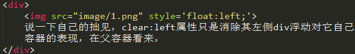
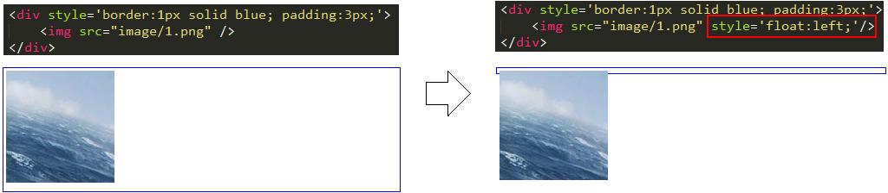
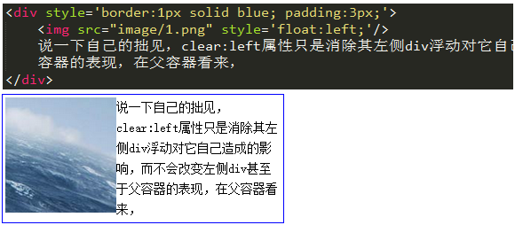
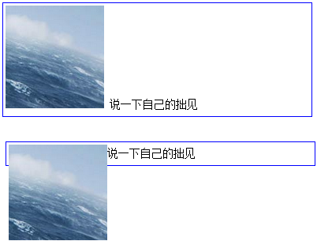
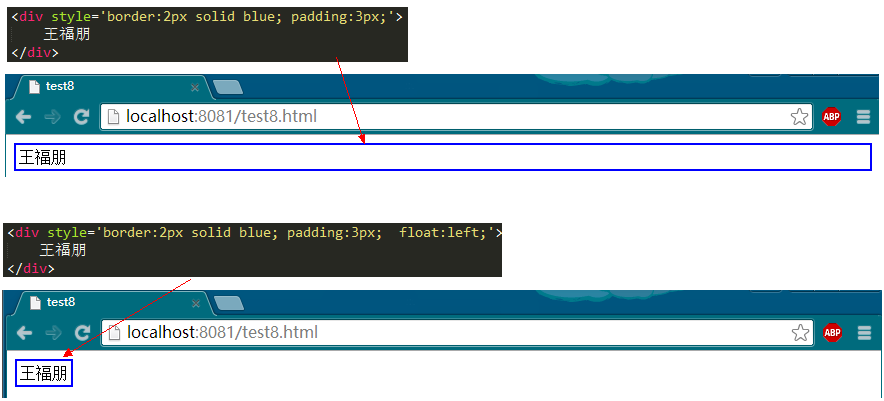
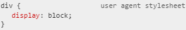
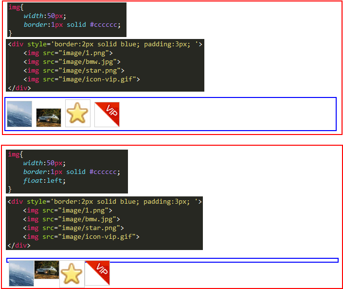

# 08 重新认识float

##01 误解和“误用”
既然提到“误用”，各位看官就此想想，自己平日是怎么使用float的？另外，既然“误用”加了引号，就说明这样的使用并不是真正的误用，而是误打误撞使用之后，带来了真正的效果。

　　这样一问大家，我想绝大多数用float都是为了——横向排版、或者多列布局。这样的使用是正确的，大部分人都这样使用，bootstrap的栅格系统也是使用了float来实现的，并且在css3被普及之前，多列布局的最佳解决方案也是使用float——要不然你就用table。

　　但是，这样使用确实是对float的一种误解和“误用”，因为float被设计出来的初衷是用于——**文字环绕效果**。即，一个图片一段文字，图片float:left之后，文字会环绕图片。

但是，当时的多列布局和横向排版主要是依靠table实现，后来人们见见的发现，使用table将导致代码量大、混乱、不利于SEO，然后发现float+div是一个很不错的排版解决方案，于是乎——过去几年“css+div”页面排版一直是一个热门话题，也是各种高大上的面试题必考的一项。

　　初学float的同学，你如果没有从最基础的知识入手，而是从网络的零散之后或者同事同学的零散代码学起的话，你可能只知道float是用来排版的，但是你却不知道float的许多个特性，这就导致了你在使用float时的许多问题。不信请看下文。

##02 破坏性
首先大家来看两个demo，如下图。第一个demo是一个简单不过的例子，显示效果也很正常。第二个demo，唯一的区别就在于``加了float:left，上层的`
`却出现了“坍塌”现象。

　

　　不过，这就是float的“破坏性”——float破坏了父标签的原本结构，使得父标签出现了坍塌现象。导致这一现象的最根本原因在于：**被设置了float的元素会脱离文档流**。

　　初次接触“脱离文档流”的朋友可以这样理解：div是父亲，img是它的儿子，原本好好的父子关系，原本爷俩可以体面的展示一个包含关系的效果。直到有一天，img被设置了float。老天爷（浏览器）规定，任何float元素都不允许再呆在自己的家族中，于是img被逐出家门，断绝和div父子关系。于是乎，div没有了img儿子，也就不能再展示这种父子的包含关系，于是两者就各过各的，互不相干。——这样一说，容易理解了吧？

　　但是，永远都不要忘记float被设计的初衷——实现文字环绕效果。当div中有文字时，文字还是会环绕在img周围的。如下图：

　　　

好了，大家现在已经知道了float具有破坏性，可能也有很多朋友之前就知道这一特性，但是你有没有思考一下：float为什么会被设计成具有破坏性，为什么会脱离文档流？这一点非常重要！其实原因非常简单——为了要实现文字的环绕效果？

　　有人可能会问：啊？你刚才不是说了float的初衷就是实现文字环绕效果吗？和破坏性有啥关系？

　　这时我会反问你：如果float不让父元素坍塌，能实现文字环绕效果吗？给你两个图看看你就知道了。看不明白的可以给我留言讨论。

　

##03 包裹性
“包裹性”也是float的一个非常重要的特性，大家用float时一定要熟知这一特性。咱们还是先从一个小例子看起：

　

　　如上图，普通的div如果没有设置宽度，它会撑满整个屏幕，在之前的盒子模式那一节也讲到过。而如果给div增加float:left之后，它突然变得紧凑了，宽度发生了变化，把内容“王福朋”三个字包裹了——这就是包裹性。**div设置了float之后，其宽度会自动调整为包裹住内容宽度，而不是撑满整个父容器**。

　　注意，此时div虽然体现了包裹性，但是它的display样式是没有变化的，还是block。

说道这里咱们回顾一下，在之前的博客中，也提到了“包裹性”，是哪些样式？你可以在此思考一下，我会在博客的评论中给出答案 。

　　知道了包裹性之后，我们还是继续思考：float为什么要具有包裹性？其实答案还得从float的设计初衷来寻找，float是被设计用于实现文字环绕效果的。文字环绕图片比较好理解，但是如果想要让文字环绕一个div呢？此时div不被“包裹”起来，那么如何去实现环绕效果？

　　道理很简单，你也可能是那种一点即通的聪明人，但是关键在于思考。

##04 清空格
　float还有一个大家可能不是很熟悉的特性——清空格。按照惯例，咱还是先举例子说明。

上图中。第一个例子，正常的img中间是会有空格的，因为多个标签会有换行，而浏览器识别换行为空格，这也是很正常的。第二个例子中，img增加了float:left的样式，这就使得img之间没有了空格，四个img紧紧挨着。

　　如果大家之前没注意，现在想想之前写过的程序，是不是有这个特性。为什么float适合用于网页排版（俗称“砌砖头”）？就是因为float排版出来的网页严丝合缝，中间连个苍蝇都飞不进去。

　　“清空格”这一特性的根本原因是**由于float会导致节点脱离文档流结构**。它都不属于文档流结构了，那么它身边的什么换行、空格就都和它没关系的，它就尽量的往一边去靠拢，能靠多近就靠多近，这就是清空格的本质。