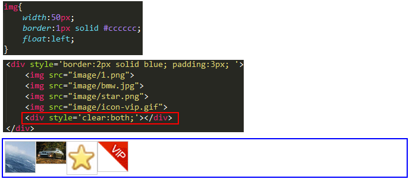
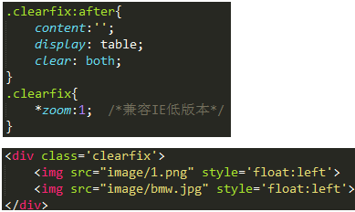
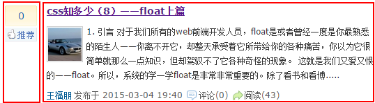
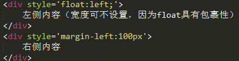
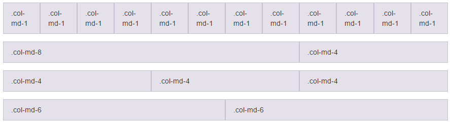
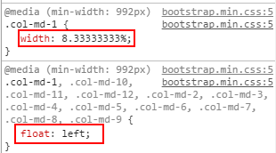

# 09 float应用

##01 清除float
《上篇》中我们提到，float具有“破坏性”，它会导致父元素“坍塌”，这将不是所要看到的。如何去避免float带来的这种影响呢（也就是我们常说的“清除浮动”） ？方法有很多种，我在这里介绍4中供大家参考，大家可根据实际情况来选择。

　　先介绍两个比较简单，但是不常用的解决方法：
1.为父元素添加overflow:hidden
2.浮动父元素

　　这两个方法比较简单，在这里也就不再演示了，大家有兴趣的可以自己去试试。

　　第三种方法也不是很常用，但是大家要知道clear:both这个东西。通过在所有浮动元素下方添加一个clear:both的元素，可以消除float的破坏性。

接下来的第四种方法是大家最需要掌握的，也是我推荐的，也是bootstrap正在用的——clearfix——不知道的同学一定要去搜一下，要不然就太low了！

上图中，我们定义一个.clearfix类，然后对float元素的父元素应用这一样式即可，非常简单吧？注意，你可能会搜出不同版本的clearfix，有的代码比上图中的代码多，你不用理会它，就按照我的贴图的代码写就行。

　　究其原理，其实就是通过伪元素选择器，在div后面增加了一个clear:both的元素，跟第三种方法是一个道理。

##02 合理使用float布局网页
《上篇》中提到，我们使用float做网页布局，是一种误解和“误用”。估计大多数人误解了float的原本设计初衷，但是这里的“误用”是要加引号的，因为这是一种无心插柳的应用。即，用float做网页布局是很合情合理的，鼓励同志们继续使用。

　　但是用float做网页布局也是有许多技巧的，准确的应用会提高网页的灵活性。下面我列举两个常用的网页布局案例，仅供大家参考，不喜勿喷，善意留言！

+ 第一，三列布局

　　博客园的主页就是经典的三列布局，很明显的左、中、右。

对于这种布局，我给出的布局方案是：

+ 第二，两列布局

　　以博客园一篇文章的链接为例，它分为左、右结构

对于这种布局的格式，我的设计方案是：

## 03 BootStrap的栅格系统

　　如果您熟悉并使用bootstrap，那么您将不必自己去操心网页布局，因为bootstrap已经把网页分成了12列，您可以随意设置多列布局，非常方便。这就是bootstrap的栅格系统。此处不会详解栅格系统，就是简单看看栅格系统的实现，它是用float实现的。

　通过浏览器监控每个单元格的css样式，可以发现，单元格通过百分比设置了宽度，通过float:left设置了浮动。

对于父元素的清除浮动，bootstrap使用的就是《上篇》中说的clearfix，大家可以自行检测一下试试。

　　多看看经典软件的源码是学习的一个捷径，学习css可以看看bootstrap，学习js可以看看jquery……