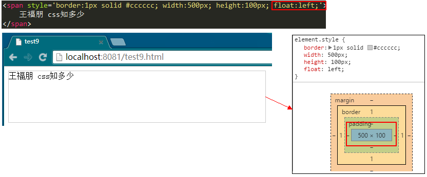

# 10 display 

网页的所有元素，除了“块”就是“流”，而且“流”都是包含在“块”里面的（最外层的body就是一个“块”）。在本系列一开始讲《浏览器默认样式》的时候，大家也都看到了浏览器默认样式中规定了html元素哪些属于“块”（剩下的就是“流”）。这部分知识非常重要也非常基础，因此在所有的前端面试题中，都会问道哪些元素是“块”哪些元素是“流”。

其实，这部分知识都囊括在display这个样式设置中。在网上查找出display所有的属性，你会发现它有很多，但是不是每个都常用，甚至大部分你都没有用过。这个没关系，学以致用，用不到的就可以先不学，知道就行，什么时候用，什么时候再去详细学——前提是你知道有这么个东西，否则无从下手。

看上图。常用的属性有：none、block、inline、inline-block、inherit，其中inherit是继承父元素的样式，不用多说，其他的几个会在下文详解。其他的都不常用，但是有一些还是需要点出来，其实这些已经在《浏览器默认样式》一节讲到了，这里简单描述一下，详细的可以参考浏览器默认样式一节。

1.list-item：通过它可以模拟li列表样式；
2.table：也是一个“块”，但和block相比，table具有包裹性；
3.table-cell：最新的多列布局解决方案；

## 02 inline
　常用的inline就是文字和图片，其实inline真没什么好说的，大家可以把它想象成一个杯子里的水，它是“流”，是没有大小和形状的，它的宽度取决于父容器的宽度。

　　因此，针对inline的标签，你设置宽度和高度是无效的，通过监控可以知道，该元素实际的宽度和高度都是auto，并不是我们设定的值。

一个很基础的问题：如何把inline元素转换成“块”元素？相信绝大部分人的回答是display:block，但是你应该知道这不是一个唯一的答案。至少我设置display:table也是可以的吧？

还有两种情况你应该去了解（如果你不知道的话）：

+ 第一，对inline元素设置float

还是刚才那个例子，我们对span元素添加一个float:left，运行看看效果，你就会大吃一惊。从显示的效果和监控的结果上看来，span元素已经“块”化。注意，上一节刚刚讲完float，不要忘记float的“破坏性”、“包裹性”，在这里同样适用。

+ 第二，对inline元素设置position:absolute/fixed

还是有同一个例子做演示，这次在span元素上加上absolute/fixed，效果大家应该能猜到，和加上float的效果相同。至于absolute/fixed有什么特性，会在下一节介绍position时提到。

##02 block
　　本系列有一节重点讲解了《盒子模型》，不知道大家看没看过，或者说你已经很了解盒子模型了。

　　其实对于block，我觉得就是“盒子模型”。一个元素设置了block，它就必须遵循盒子模型的规则。因此，这里也不再去详细写它了，大家可以去盒子模型那一节好好看看，就那么点内容。

##03 inline-block
　　这个话题还得从《浏览器默认样式》这一节开始。浏览器默认样式中规定了几个html元素为display:inline-block，回顾一下。

　　

　　初学者对于inline-block可能比较陌生，没关系，一步一步来。首先，你应该知道inline是什么样子的，就是一般的文字、图片；其次，你应该知道block是什么样子的，一般的div就是；最后，inline-block顾名思义，它既有inline的特性，又有block的特性，大家可以想想一般的button、input是什么样子的。

　　那button举例子。我们在页面中输入若干个`<button>`，发现它们是“流”式排列的（可以对比一下若干个`
`的排列方式）。但是针对一个button，我们还可以自定义修改它的形状，这样就有“块”的特征。

      

　　因此，inline-block的特点可以总结为：外部看来是“流”，但是自身确实一个“块”。不知道大家理解也无？