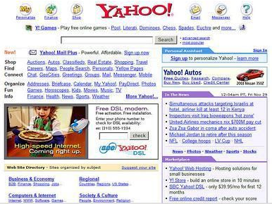
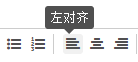
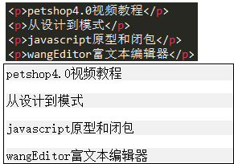
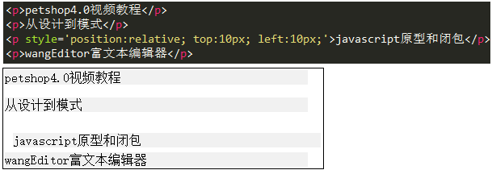
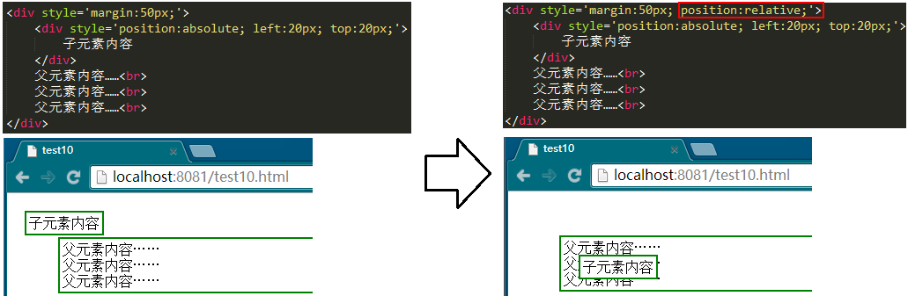
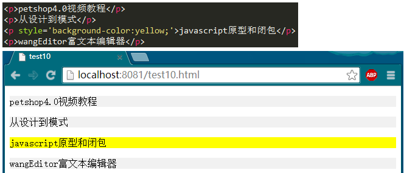
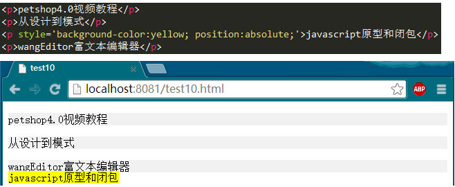
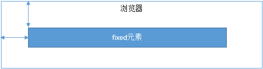

# 11 position 

本文将用一篇文章介绍position（定位），在学习position之前，我们应该去思考一个问题：什么情况下我们需要定位？如果没有定位将无法满足我们怎样的需求？我们要知道，被人类创造出来的每一个知识，都有它的用途，都要解决一些之前遇到的问题。

　　如果没有定位，我们做出来的网页将会是按部就班的自上而下、自左而右的平铺在浏览器上，外加通过margin和padding调整一下间距，还有就是通过float来浮动某些元素。做一些简单的网页这样就够了，例如N年之前的yahoo，虽然现在看来很low。

　但是有些情况下，这种按部就班的网页排版满足不了我们的要求，我们需要某些元素跑出来，悬浮在网页上面，而且需要给它指定一个位置。这时候我们就需要用到了position，而且是非用不可。如下图：

##01 relative

查资料可知道，position一共有四个可选属性：static/relative/absolute/fixed。其中static（静态定位）是默认值，即所有的元素如果不设置其他的position值，它的position值就是static，有它跟没有它一样。就不多介绍了。

　　相对定位relative可以用一个例子很轻松的演示出来。例如我们写4个`
`，出来的样子大家不用看也能知道。

      

　　然后我们在第三个`
`上面，加上`position:relative`并且设置left和top值，看这个`
`有什么变化。

 

上图中，大家应该要识别出两个信息（相信大部分人会忽略第二个信息）

第三个`
`发生了位置变化，分别向右向下移动了10px；
其他的三个`
`位置没有发生变化，这一点也很重要。
　　因此，**relative会导致自身位置的相对变化，而不会影响其他元素的位置、大小的变化**。这是relative的要点之一。还有第二个要点，就是**relative产生一个新的定位上下文**，下文有关于定位上下文的详细介绍，这里可以先通过一个例子来展示一下区别：

 

注意看这两图的区别，下文将有解释。

##02 absolute

说道absolute，推荐大家去看一个[视频教程](http://www.imooc.com/learn/192)，讲师对absolute讲的非常透彻，本文的一些内容也是参考了这篇教程，好东西大家一起分享吗！

话归正传，咱们还是拿之前那个例子说事儿，先写一个基本的页面——4个`
`

　

　　然后，我们把第三个`
`改为absolute，看看会发生什么变化。

　

从上面的结果中，我们能看出几点信息：
1.absolute元素脱离了文档结构。和relative不同，其他三个元素的位置重新排列了。只要元素会脱离文档结构，它就会产生破坏性，导致父元素坍塌。（此时你应该能立刻想起来，float元素也会脱离文档结构）
2.absolute元素具有“包裹性”。之前`
`的宽度是撑满整个屏幕的，而此时`
`的宽度刚好是内容的宽度。
3.absolute元素具有“跟随性”。虽然absolute元素脱离了文档结构，但是它的位置并没有发生变化，还是老老实实的呆在它原本的位置，因为我们此时没有设置top、left的值。
4.absolute元素会悬浮在页面上方，会遮挡住下方的页面内容。

　最后，通过给absolute元素设置top、left值，可自定义其内容，这个都是平时比较常用的了。这里需要注意的是，设置了top、left值时，元素是相对于最近的定位上下文来定位的，而不是相对于浏览器定位。下文马上会讲定位上下文。

　　但是有时候设置top、left值并不是定位的最佳解决方案。例如想要元素A紧跟在元素B的上方，可通过设置元素B为absolute，然后调整B的margin值来确定，这样更有效率。如下图：

　

　　以上提到的信息，如果展开来说，内容非常多，而且用文本也不好描述，还是推荐大家去看慕课网的那篇视频教程，讲的很有意思。

最后，再提几个小知识点。

+ 设置absolute会使得inline元素被“块”化，这在上一节将display时已经说过；
+ 设置absolute会使得元素已有的float失效。不过float和absolute同时使用的情况不多；
+ 上文提到了absolute会使元素悬浮在页面之上，如果有多个悬浮元素，层级如何确定？答案是“后来者居上”

## 03 fixed

其实fixed和absolute是一样的，唯一的区别在于：absolute元素是根据最近的定位上下文确定位置，而fixed永远根据浏览器确定位置。

上文很多次提到了“定位上下文”，那么它到底是一个什么东东？答案马上揭晓。

## 04 定位上下文
+ relative的定位

relative元素的定位永远是相对于元素自身位置的，和其他元素没关系，也不会影响其他元素。

+ fixed的定位

fixed元素的定位永远是相对于浏览器边界的，和其他元素没有关系。但是它具有破坏性，会导致其他元素位置的变化。

+ absolute的定位

absolute的定位相对于前两者要复杂许多。如果为absolute设置了top、left，浏览器会根据什么去确定它的纵向和横向的偏移量呢？答案是浏览器会递归查找该元素的所有父元素，如果找到一个设置了position:relative/absolute/fixed的元素，就以该元素为基准定位，如果没找到，就以浏览器边界定位。如下两个图所示：

上图中的“某一层祖先元素”就是该absolute元素的定位上下文。讲到这里，我们上文中的那个图，大家能看明白了吧？还有不明白的可以留言给我。

