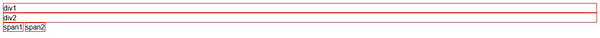
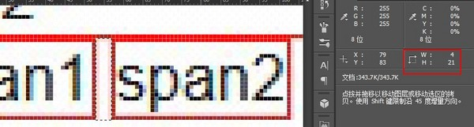
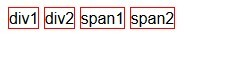
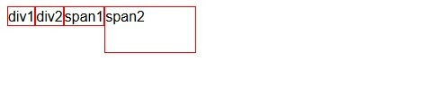

# 浮动与清浮动

## 浮动

以`<div>`和`<span>`为例：
```
    <style type="text/css">
	div, span {border: 1px solid red;}
	</style>
```

```
<body>
    <div class="div1">div1</div>
	<div class="div2">div2</div>
	<span class="span1">span1</span>
	<span class="span2">span2</span>
</body>
```

在网页中的渲染效果如下：



可以得出以下结论：

1. 块状元素 div 占满整行；
2. 块状元素支持宽高，不设置时宽默认占满整行，高由内容撑开；
3. 内嵌（行内）元素 span 不支持宽高，由内容撑开；
4. span 换行被解析，两个 span 之间间距4像素（即1个半角空格）。



## inline-block
----

给`span` 和` div` 添加 `inline-block`：

```
<style type="text/css">
    display: inline-block;
</style>
```
在 Firefox39 得到如下渲染效果：



可以得到以下结论：

1. div 被显示为内嵌（行内）元素；

2. 换行被解析成5像素；

3. 内嵌元素支持宽高，不设置时由内容撑开。

> inline-block 是 CSS2.1 新增的值,IE7不支持float 
------

因为 `inline-block` 不支持部分 `IE` 版本，因此尝试第二种方法：`float`。
添加 `float: left` 样式，并给 `span2` 设置宽高：

```
<style type="text/css">
	div, span {
		border: 1px solid red;
		float: left;
	}

	.span2 {
		width: 100px;
		height: 50px; 
	}
</style>
```
ff 中得到如下渲染效果：


可以看出：

1. 使块元素在一行显示;
2. 换行未被解析（各元素之间无间距）；
3. 支持宽高，不设置宽高时由内容撑开。

IE7 渲染效果如下，无 bug

> float 是浮动的利器，这也说明了为什么各大网站会普遍使用 float。 

## float 特点：

**脱离文档流**

文档流是指文档中可显示对象在排列时所占用的位置。将窗体自上而下分成一行行, 并在每行中按从左至右的顺序排放元素。
脱离文档流即不再按照默认的自上而上、从左至右的顺序进行排列，而是按照规定的样式进行显示。

**脱离文档流之后，按照指定的一个方向移动直到碰到父级的边界或者另外一个浮动元素停止**


## 清浮动

浮动意味着脱离了文档流（层级提升“半层”），不再按照原来的逻辑自上而自、从左到右排列元素，那么必然会对原来的元素布局产生影响，那么清浮动就是为了清除浮动带来的负面效果。比如下面一段代码：

```
    .div1 {
		float: left;
		width: 200px;
		height: 200px;
		background-color: red;
	}
	.div2 {
		width: 300px;
		height: 300px;
		background-color: blue;
	}
```
```
	<div class="div1">div1</div>
	<div class="div2">div2</div>
```
结果就会导致 div1 遮挡住一部分 div2，当然可以通过其他方法来解决这个问题，如设置 div2 的 position，但这是逃避问题，而不是解决问题（清浮动）。以下是我总结的清浮动常用方法：

**clear**
clear是为清浮动而生，清浮动并不是并浮动的元素清除掉，而是指不允许指定元素的某个方向上出现浮动元素。clear 的常用值有：left/right/both/none，通常用 `both`。
给上文代码中 div2 的样式添加这一属性：

```
.div2 {
		clear: both;
	}
```
结果发现 div2 在下一行显示，且换行未被解析成空格。在 Chrome44/FF39/IE-11 下面均测试通过，棒呆！看来 clear似乎是清浮动的万能钥匙。


**“塌陷”的本质**

再来测试嵌套元素中的浮动效果：
```
	<style type="text/css">
	body {
		margin: 0;
		padding: 0;
	}
	.div1 {
		border: 10px solid #000;
		margin: 20px auto;
		width: 600px;
	}
	.div2 {
		background-color: red;
		width: 400px;
		height: 300px;
		float: left;

	}
```
```
	</style>
	<div class="div1">
		<div class="div2"></div>
	</div>
```


结果在 FF39 中得到了如下的显示效果：


去掉 div2 的 float:left，显示如下：


可以看出，float属性使 div2 的父级元素 div1 高度变为0，俗称“塌陷”。很多人从float对父级元素的影响来解释“塌陷”，按照我个人的理解，如下：
我们回归 float 的本质，浮动会导致当前元素脱离文档流，提升自身层级“半层”，也就是说浮动的元素也就不再属于原来的层级，在这里来说，从显示效果（样式）上看： div2 也就不再是 div1 的子元素。


在这个例子中，再添加 div3：
```
	<div class="div3"></div>
	.div3 {
		width: 600px;
		border: 10px solid #000;
		margin: 0 auto;
	}
```
在 FF39 中得到如下效果：


也就是说，div 块级元素的内容为空时，其 Content Width/Height = 0。既然浮动元素不再属于原来的父级元素，那父级元素里里就是空的，因此也就无所谓“塌不塌陷”一说了。借用一句禅语：“本来无一物，何处惹尘埃！”

总结上文，在结构(HTML)上，div2 属于 div1。但是，在形式(CSS)上，div2 不属于 div1。也就是说，这是结构和形式分离带来的矛盾。而清浮动，在某种意义上就是为了清除这一矛盾。


清浮动：父级元素

清浮动，无非从两方面着眼，一是父级元素本身，二是父级元素里的内容。
一、从父级元素本身来：
既然是由于父级元素和子级元素不在同一层级，那么可以给父级元素添加浮动：float/display:inline-block：


但是，这种方法的缺陷在于：改变了父级元素的样式，还要添加其他样式，增加了工作量，如果是多层嵌套的话，那势必要修改多个父级元素的样式，“子子孙孙无穷尽也”~


清浮动：子级元素

二、从子级元素考虑，也就是从父级元素里的内容考虑：
既然是因为父级元素 div1 中没有内容导致的，那可以考虑在 div1 里面加点料：

方法1：
```
	.clear{
		clear: both;
        height: 0;    // 解决 IE6 下最小高度19px的问题
		font-size: 0;    // 解决 IE6 下最小高度19px的问题
	}
	<div class="clear"></div>
```
经测试，IE7（包括）以上，加注释的两行不写其实也没关系。

方法2：
```
	<br clear='both'>
```
IE6 以上全兼容，关于<br clear='both'>这一行，可以查阅 w3c 中文网的解释。

方法3：

方法1和方法2的缺陷在于，需要在<HTML>中添加内容。为了改变样式而添加内容，这违背了结构与样式分享的原则。
因此，可以考虑采用伪类:after，并结合方法2：
```
	.clear {
		zoom: 1;    // zoom 是 IE6 私有属性
	}
	.div1:after {
		content: '';
		display: block;
		clear: both;
	}
	<div class="div1 clear">
		<div class="div2"></div>
	</div>
```
带注释的一行是专门针对 IE6 的小 hack，因为刚装了 Win10，IETester 好像出了点问题不能用了，因此没测试 IE6 下的兼容性，IE7 及以上均测试通过。