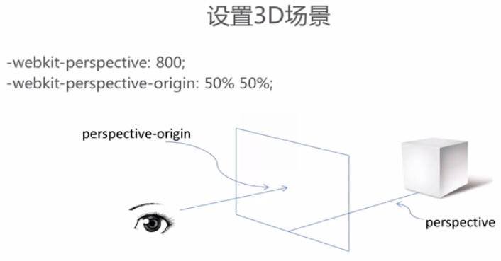
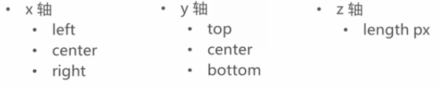

# transition: 动画过度

## 用法：
```
transition:<过度属性名称> <过度时间> <过度模式>;
```
相当于:
```
transition-property: ;
transition-duration: ;
transition-timing-function: ;
```

其中过度模式的值：transition-timing-function 包括：
+ ease      缓慢开始 缓慢结束
+ linear    匀速
+ ease-in   缓慢开始
+ ease-out  缓慢结束
+ ease-in-out 缓慢开始 缓慢结束（稍有区别）


# 3D 设置： transform



- 使用transform属性调整设置: `-webkit-transform-style:-webkit-preserve-3d;`

 - translate(位移)
    + translateX
    + translateY
    + translateZ
    
 - rotate ()
    + rotateX
    + rotateY
    + rotateZ

- 使用transform-origin属性调整旋转中心
