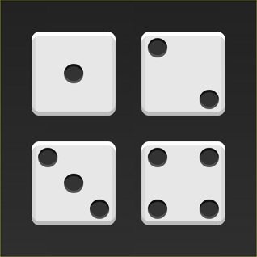
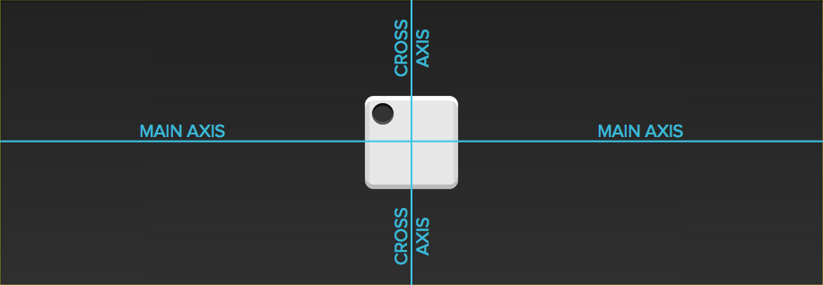
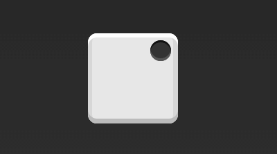

# Flex 布局实例


## 一、骰子的布局
骰子的一面，最多可以放置9个点。



下面，就来看看Flex如何实现，从1个点到9个点的布局。你可以到codepen查看Demo。



如果不加说明，本节的HTML模板一律如下。
```
<div class="box">
  <span class="item"></span>
</div>
```
上面代码中，div元素（代表骰子的一个面）是Flex容器，span元素（代表一个点）是Flex项目。如果有多个项目，就要添加多个span元素，以此类推。

### 1.1 单项目
首先，只有左上角1个点的情况。Flex布局默认就是首行左对齐，所以一行代码就够了。


```
.box {
  display: flex;
}
```

设置项目的对齐方式，就能实现居中对齐和右对齐。


```
.box {
  display: flex;
  justify-content: center;
}
```



```
.box {
  display: flex;
  justify-content: flex-end;
}
```

设置交叉轴对齐方式，可以垂直移动主轴。


```
.box {
  display: flex;
  align-items: center;
}
```


```
.box {
  display: flex;
  justify-content: center;
  align-items: center;
}
```


```
.box {
  display: flex;
  justify-content: center;
  align-items: flex-end;
}
```


```
.box {
  display: flex;
  justify-content: flex-end;
  align-items: flex-end;
}
```
## 1.2 双项目


```
.box {
  display: flex;
  justify-content: space-between;
}
```


```
.box {
  display: flex;
  flex-direction: column;
  justify-content: space-between;
}
```


```
.box {
  display: flex;
  flex-direction: column;
  justify-content: space-between;
  align-items: center;
}
```


```
.box {
  display: flex;
  flex-direction: column;
  justify-content: space-between;
  align-items: flex-end;
}
```


```
.box {
  display: flex;
}
.item:nth-child(2) {
  align-self: center;
}
```


```
.box {
  display: flex;
  justify-content: space-between;
}
.item:nth-child(2) {
  align-self: flex-end;
}
```
## 1.3 三项目


```
.box {
  display: flex;
}
.item:nth-child(2) {
  align-self: center;
}
.item:nth-child(3) {
  align-self: flex-end;
}
```
### 1.4 四项目


```
.box {
  display: flex;
  flex-wrap: wrap;
  justify-content: flex-end;
  align-content: space-between;
}
```


HTML代码如下。

```
<div class="box">
  <div class="column">
    <span class="item"></span>
    <span class="item"></span>
  </div>
  <div class="column">
    <span class="item"></span>
    <span class="item"></span>
  </div>
</div>
```

CSS代码如下。

```
.box {
  display: flex;
  flex-wrap: wrap;
  align-content: space-between;
}
.column {
  flex-basis: 100%;
  display: flex;
  justify-content: space-between;
}
```
### 1.5 六项目


```
.box {
  display: flex;
  flex-wrap: wrap;
  align-content: space-between;
}
```


```
.box {
  display: flex;
  flex-direction: column;
  flex-wrap: wrap;
  align-content: space-between;
}
```


HTML代码如下。

```
<div class="box">
  <div class="row">
    <span class="item"></span>
    <span class="item"></span>
    <span class="item"></span>
  </div>
  <div class="row">
    <span class="item"></span>
  </div>
  <div class="row">
     <span class="item"></span>
     <span class="item"></span>
  </div>
</div>
```

CSS代码如下。

```
.box {
  display: flex;
  flex-wrap: wrap;
}

.row{
  flex-basis: 100%;
  display:flex;
}

.row:nth-child(2){
  justify-content: center;
}

.row:nth-child(3){
  justify-content: space-between;
}
```
### 1.6 九项目


```
.box {
  display: flex;
  flex-wrap: wrap;
}
```
## 二、网格布局

### 2.1 基本网格布局

最简单的网格布局，就是平均分布。在容器里面平均分配空间，跟上面的骰子布局很像，但是需要设置项目的自动缩放。


HTML代码如下。
```
<div class="Grid">
  <div class="Grid-cell">...</div>
  <div class="Grid-cell">...</div>
  <div class="Grid-cell">...</div>
</div>
```
CSS代码如下。

```
.Grid {
  display: flex;
}

.Grid-cell {
  flex: 1;
}
```


2.2 百分比布局

某个网格的宽度为固定的百分比，其余网格平均分配剩余的空间。


HTML代码如下。
```
<div class="Grid">
  <div class="Grid-cell u-1of4">...</div>
  <div class="Grid-cell">...</div>
  <div class="Grid-cell u-1of3">...</div>
</div>
```

```
.Grid {
  display: flex;
}

.Grid-cell {
  flex: 1;
}

.Grid-cell.u-full {
  flex: 0 0 100%;
}

.Grid-cell.u-1of2 {
  flex: 0 0 50%;
}

.Grid-cell.u-1of3 {
  flex: 0 0 33.3333%;
}

.Grid-cell.u-1of4 {
  flex: 0 0 25%;
}
```